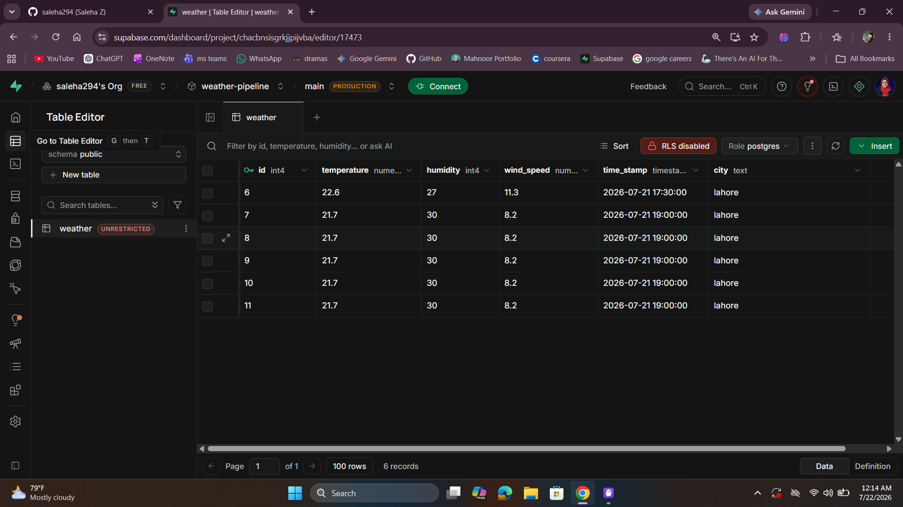
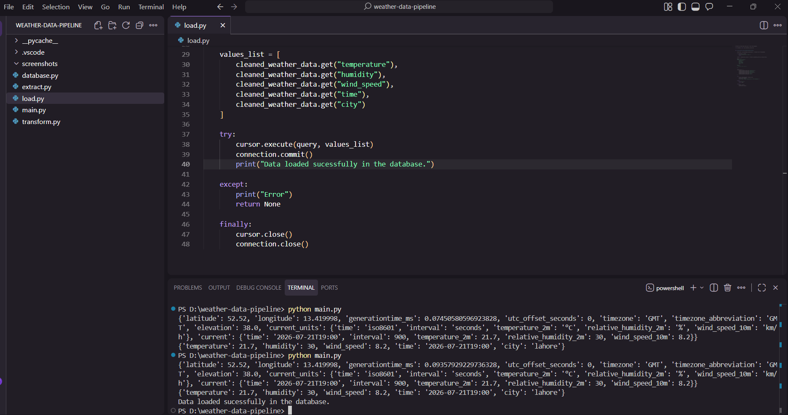

<div align="center">

# 🌦️ Weather ETL Pipeline

### *From API to PostgreSQL — Building a Modern Data Pipeline.*

A beginner-friendly Data Engineering project that extracts real-time weather data from the Open-Meteo API, transforms nested JSON into a clean schema, and loads it into a PostgreSQL database hosted on Supabase.


</div>

---

# ✨ Overview

This project demonstrates a complete **Extract → Transform → Load (ETL)** pipeline built with Python.

The pipeline retrieves live weather data from the **Open-Meteo API**, transforms the nested JSON response into a clean and structured format, and stores it inside a **PostgreSQL** database hosted on **Supabase**.

The project focuses on understanding the fundamentals of Data Engineering, including API integration, data transformation, SQL, and cloud databases.

---

# 🚀 Features

### 🌐 Extract

- Connects to the Open-Meteo API
- Retrieves real-time weather data
- Parses JSON responses into Python dictionaries

### 🧹 Transform

- Cleans nested API responses
- Maps API field names to a custom database schema
- Creates a structured weather record

### 🗄️ Load

- Connects to PostgreSQL using Psycopg2
- Inserts cleaned data using parameterized SQL queries
- Safely commits transactions
- Closes database connections after execution

---

# 🛠 Tech Stack

## Languages

- Python
- SQL

## Database

- PostgreSQL
- Supabase

## Libraries

- Requests
- Psycopg2
- Python Dotenv

---

# 📁 Project Structure

```text
weather-data-pipeline/
│
├── screenshots/
│
├── .env.example
├── .gitignore
├── README.md
├── database.py        # PostgreSQL connection
├── extract.py         # Extract weather data from API
├── load.py            # Load data into PostgreSQL 
├── main.py            # Run the ETL pipeline 
├── transform.py       # Clean & transform the data


```

---

# 🔄 ETL Workflow

```text
Open-Meteo API
       │
       ▼
Extract Weather Data
       │
       ▼
Transform JSON
       │
       ▼
Create Clean Dictionary
       │
       ▼
Insert into PostgreSQL
       │
       ▼
Supabase Database
```

---

# 📸 Screenshots

## 📸 Database



---

## 💻 Terminal Output



---

# 💡 What I Learned

Throughout this project I learned how to:

- Consume REST APIs using Python
- Work with JSON data
- Transform nested dictionaries
- Connect Python to PostgreSQL
- Write parameterized SQL queries
- Build modular ETL pipelines
- Debug API, SQL, and database connection issues
- Organize Python projects into reusable modules

---

# 🚀 Future Improvements

- Schedule automatic data collection
- Store multiple cities
- Add logging
- Use Docker
- Create a dashboard for weather analytics
- Deploy the pipeline to the cloud

---

# ⚙️ Setup

Clone the repository

```bash
git clone https://github.com/saleha294/weather-data-pipeline.git
```

Install dependencies

```bash
pip install -r requirements.txt
```

Create a `.env` file using `.env.example`

```env
DB_HOST=
DB_NAME=
DB_USER=
DB_PASSWORD=
DB_PORT=
```

Run the pipeline

```bash
python main.py
```

---

# 👩‍💻 Author

## Saleha Zeeshan

AI Student • Exploring Data Engineering • Full-Stack Developer • Designer at Heart

- Portfolio: https://salehazportfolio.vercel.app
- GitHub: https://github.com/saleha294

---

<div align="center">

### ⭐ If you found this project interesting, consider giving it a star!

Built with Python, PostgreSQL, and curiosity. 🚀

</div>
